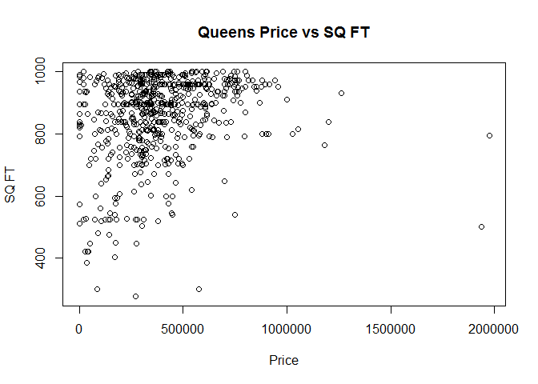

# Graphs and Plots
VAhir  
May 31, 2016  

**Step 1**  
First step in this RMD file is to correct the data type of couple of  columns in input file.  
Here class output for Sale Price and Sale Date are printed before and after the handling.


```
## [1] "integer"
```

```
## [1] "Date"
```
  
** Step 2**  
Next part will create a final file that will be ready for analysis. 
You should be able to see "FinalQueensData.csv" in Data folder after this step.  


```
## [1] 662
```

```
## [1] "C:/Users/vishal/Desktop/SMU/Unit3and4Assignment/QueensRollingSalesDataAnalysis/Data"
```

**Step 3**  
Now that the final file is present for creating charts/graphs, we will generate first plot.


```
## [1] "C:/Users/vishal/Desktop/SMU/Unit3and4Assignment/QueensRollingSalesDataAnalysis/Paper"
```

<!-- -->

